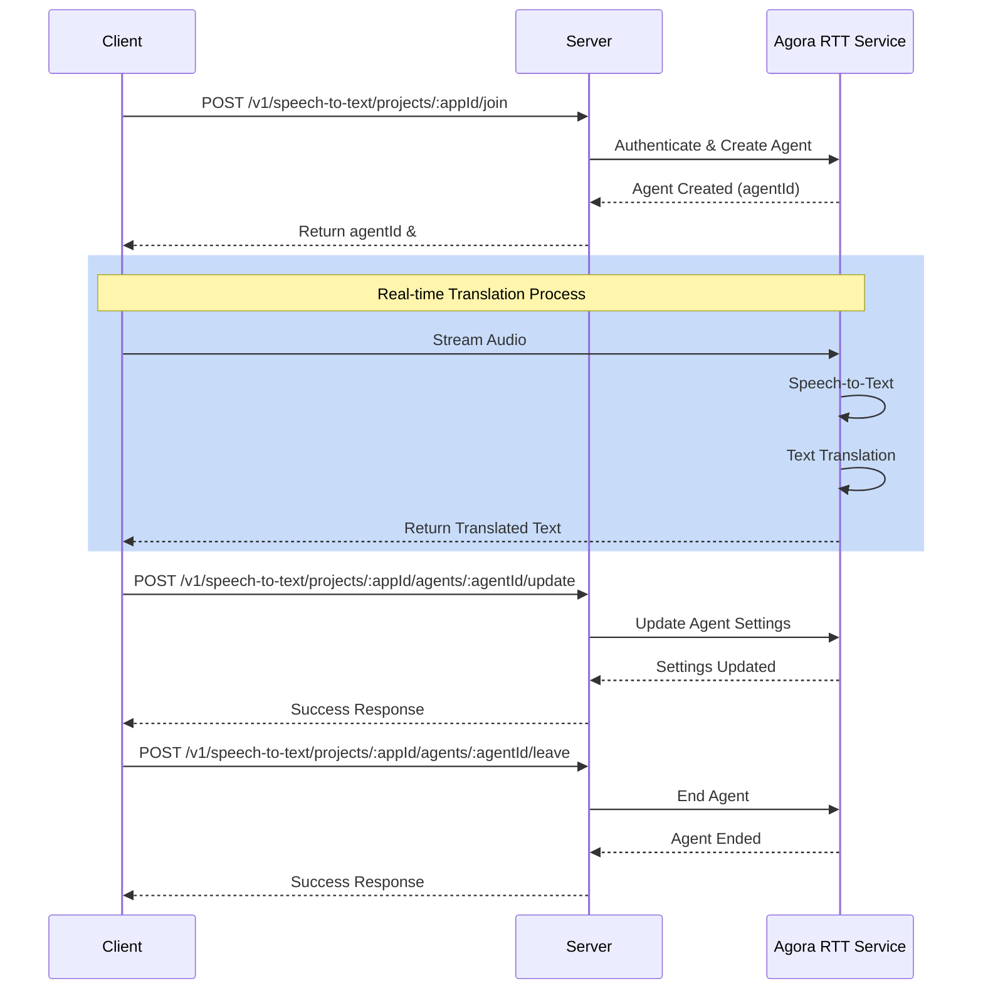

# Agora RTT Demo Server

This project demonstrates the integration of Agora's Real-Time Translation (RTT) service, providing speech-to-text and AI translation capabilities.

## Features

- Real-time speech-to-text conversion
- AI-powered translation
- RESTful API endpoints
- Configurable logging
- Cross-Origin Resource Sharing (CORS) support

## System Workflow



## Prerequisites

- Go 1.20 or higher
- Make (for building)
- Agora account and credentials

## Project Structure

```
.
├── backend/
│   ├── cmd/            # Application entry points
│   ├── configs/        # Configuration files
│   ├── internal/       # Internal packages
│   ├── vendor/         # Dependencies
│   ├── Makefile        # Build scripts
│   ├── go.mod          # Go modules file
│   └── go.sum          # Go modules checksum
└── LICENSE
```

## Configuration

Copy the example configuration file and modify it according to your needs:

```bash
cp configs/config.example.toml configs/config.toml
```

Configuration parameters:

```toml
[log]
fileName = "/data/logs/server.log"  # Log file path
level = "INFO"                      # Log level (DEBUG, INFO, WARN, ERROR)
maxSize = 10                        # Max log file size in MB
mode = 0                           # Log mode (0: console, 1: file, 2: both)

[httpServer]
port = 8084                        # HTTP server port

[transAIServiceConfig]
baseURL = "https://api.agora.io"   # Agora API base URL

[transAIAppIdConfigs.your_app_id]
appCert = "<your_app_certificate>"                     # Your Agora app certificate
appId = "<your_app_id>"                                # Your Agora app ID
authPassword = "<your_auth_password>"                  # Console Customer Secret
authUsername = "<your_auth_username>"                  # Console Customer Key
```

## Building and Running

1. Build the project:
```bash
make build
```

2. Run the server:
```bash
make run
```

Now your server is running on port 8084.

## API Endpoints

The server provides the following REST API endpoints:

### Speech-to-Text Endpoints

```
POST /v1/speech-to-text/projects/:appId/join           # Join a speech-to-text agent
POST /v1/speech-to-text/projects/:appId/agents/:agentId/leave    # Leave a speech-to-text agent
POST /v1/speech-to-text/projects/:appId/agents/:agentId/update   # Update agent settings
POST /v1/speech-to-text/projects/:appId/agents/:agentId          # Get agent information
```

### Health Check

```
GET /healthz                       # Server health check endpoint
```

## Error Handling

The server implements proper error handling and logging. All errors are logged according to the configured log level and returned with appropriate HTTP status codes.

## Security

- CORS is enabled and configured
- Authentication is required through Agora credentials
- All endpoints use HTTPS when deployed in production

## License

This project is licensed under the terms found in the LICENSE file.